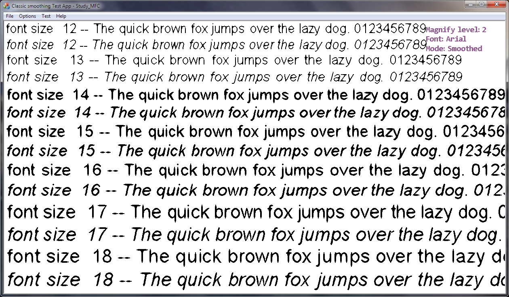
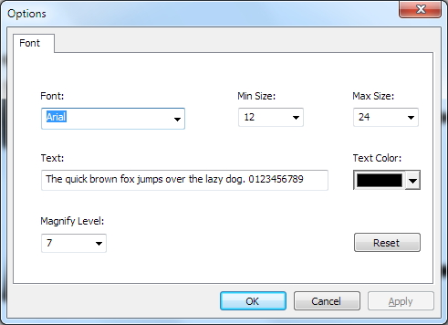

# text-smooth-with-shader
This project demonstrates a shader implementation of Euclidean paths methods for magnified text smoothing.
The method was described in a paper titled "Euclidean Paths: A New Representation of Boundary of Discrete Regions".
Once the project is compiled and run, it shows an image of un-smoothed text magnifed to 2x:

Use mouse wheel to change the magnification level (1x to 12x). User key 'f' to switch between the un-smoothed and smoothed text.
The smoothed text look like this:

By press and hold left mouse button and move, you can drag the image to see other parts of the text.
On the right upper cornor shows some information about the text image used, such as magnification level, font name and whether or not it's
smoothed. Click Options/Settings will open a dialog that allow user to change things like the text to be display, the font name.

Only 32-bit debug build is configured. If you use Visual Studio 2013 in Windows 10, you need to enable a Windows Optional Feature called "Graphics Tools"
